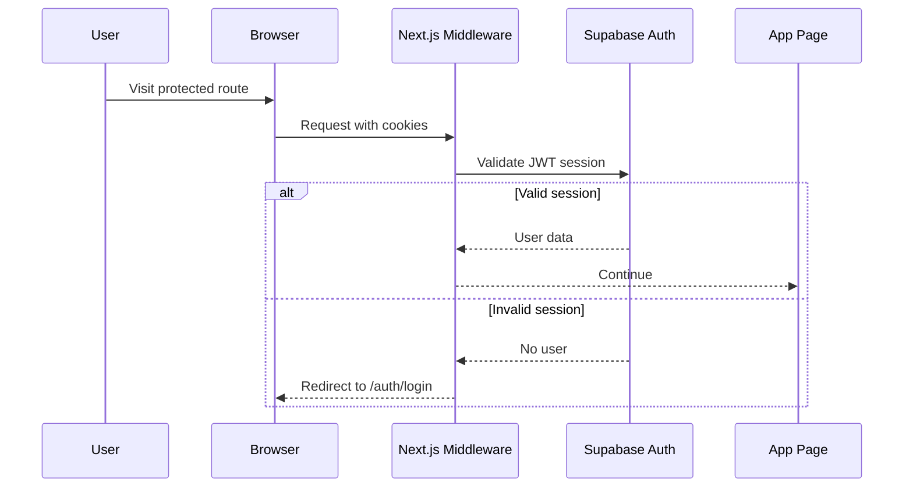

# OmniDev v1.0

OmniDev is an AI-powered developer platform that combines chat, vision
analysis, cloud automation, web scraping, storage, and location services
in one interface.

- Live app: [frontend-psi-two-25.vercel.app](https://frontend-psi-two-25.vercel.app)
- Backend API: [omnidev-qbiv.onrender.com](https://omnidev-qbiv.onrender.com)

## Table of Contents

- Overview
- Architecture
- Setup
- Authentication
- CSRF Protection
- Role-Based Access Control
- API Reference
- Error Handling
- Code Examples
- Testing
- Deployment
- Documentation Templates
- Documentation Review
- Documentation Version History

## Overview

OmniDev is a full-stack web platform built with:

- Frontend: Next.js 16, React 19, TypeScript
- Backend: FastAPI, Python 3.12+, Playwright
- Auth: Supabase JWT sessions
- Cloud: AWS (optional)

## Architecture

```text
omnidev/
├── backend/               # FastAPI services
├── frontend/              # Next.js App Router
├── docker-compose.yml     # Local orchestration
└── README.md              # Project documentation
```

## Setup

### Prerequisites

- Node.js 20+
- Python 3.12+
- Supabase project (for auth)
- Optional: OpenAI and AWS credentials for AI and cloud features

### Environment Variables

Backend (`backend/.env`):

```env
APP_ENV=development
FRONTEND_URL=http://localhost:3000
OPENAI_API_KEY=your_openai_api_key
AWS_ACCESS_KEY_ID=your_aws_access_key
AWS_SECRET_ACCESS_KEY=your_aws_secret_access_key
AWS_DEFAULT_REGION=ap-south-1

# REQUIRED: Supabase JWT Secret for authentication
# Get from: Supabase Dashboard > Project Settings > API > JWT Secret
SUPABASE_JWT_SECRET=your_supabase_jwt_secret

# REQUIRED: API Key Salt for API key generation/verification
# Generate with: openssl rand -hex 32
API_KEY_SALT=your_api_key_salt
```

**Important:** `SUPABASE_JWT_SECRET` and `API_KEY_SALT` are **required** for authentication to work. Without them, the backend will return 503 errors when trying to authenticate users.

Frontend (`frontend/.env.local`):

```env
NEXT_PUBLIC_SUPABASE_URL=https://your-project.supabase.co
NEXT_PUBLIC_SUPABASE_ANON_KEY=your_supabase_anon_key
```

### Local Development

Backend:

```bash
cd backend
python -m venv .venv
source .venv/bin/activate
pip install -r requirements.txt
playwright install chromium
uvicorn app.main:app --reload --port 8000
```

Frontend:

```bash
cd frontend
npm install
npm run dev
```

Open [http://localhost:3000](http://localhost:3000)

## Authentication

All routes require a valid Supabase session. Unauthenticated users are
redirected to `/auth/login`. Sessions are validated with JWT access tokens
in middleware before rendering protected pages.

### Authentication Flow Diagram



## CSRF Protection

For all non-idempotent requests, the middleware requires a CSRF token
header that matches a cookie.

- Cookie: `omnidev_csrf`
- Header: `x-omnidev-csrf`

Example:

```ts
import { csrfHeaders } from "./src/app/lib/csrf";

await fetch("/api/ai/chat", {
  method: "POST",
  headers: {
    "Content-Type": "application/json",
    ...csrfHeaders(),
  },
  body: JSON.stringify({ message: "Hello" }),
});
```

## Role-Based Access Control

Roles are read from the Supabase JWT user metadata:

- `user`: default role
- `admin`: privileged routes

Route rules:

- `/devops` and `/storage`: `admin`
- all other routes: `user` or `admin`

## API Access Keys

API calls require a user-specific API key derived from your account.
Generate it from the settings page or by calling:

```bash
curl -X POST https://omnidev-qbiv.onrender.com/api/auth/api-key \
  -H "Authorization: Bearer <supabase_access_token>"
```

## API Reference

Base URL: `https://omnidev-qbiv.onrender.com`

### Health

- `GET /health`

### AI

- `POST /api/ai/chat`
- `GET /api/ai/status`
- `WS /api/ai/chat/stream`

### Vision

- `POST /api/vision/analyze`
- `GET /api/vision/status`

### DevOps

- `GET /api/devops/capabilities`
- `POST /api/devops/command`
- `GET /api/devops/ec2/instances`
- `GET /api/devops/s3/buckets`
- `GET /api/devops/s3/objects/{bucket_name}`

### Scraper

- `POST /api/scraper/scrape`
- `POST /api/scraper/screenshot`
- `GET /api/scraper/status`
- `POST /api/scraper/cleanup`

### Location

- `GET /api/location/current`
- `GET /api/location/reverse`
- `GET /api/location/search`
- `GET /api/location/nearby`
- `GET /api/location/status`

### Storage

- `GET /api/storage/buckets`
- `GET /api/storage/buckets/{bucket}/objects`
- `POST /api/storage/upload`
- `GET /api/storage/download/{bucket}/{key}`
- `DELETE /api/storage/delete/{bucket}/{key}`

### Auth

- `GET /api/auth/me`
- `POST /api/auth/api-key`

### Analytics

- `POST /analytics/event`
- `GET /analytics/summary`

### Monitoring

- `GET /monitoring/summary`

## Error Handling

- Use HTTP status codes consistently:
  - `400` for bad input
  - `401` for unauthenticated
  - `403` for unauthorized role
  - `404` for missing resources
  - `500` for unexpected server errors
- Client should handle `error` fields and show user-friendly messages.
- Avoid leaking secrets in error responses.

## Scraping Guidelines

- Respect `robots.txt` and site terms of service.
- Only scrape sources you are authorized to access.
- Use reasonable request rates and avoid heavy load.
- Store and process data in compliance with local regulations.

## Code Examples

### AI Chat

```bash
curl -X POST https://omnidev-qbiv.onrender.com/api/ai/chat \
  -H "Content-Type: application/json" \
  -d '{"message":"Hello"}'
```

### Vision Analysis

```bash
curl -X POST https://omnidev-qbiv.onrender.com/api/vision/analyze \
  -F "file=@image.png"
```

### DevOps Command

```bash
curl -X POST https://omnidev-qbiv.onrender.com/api/devops/command \
  -H "Content-Type: application/json" \
  -d '{"command":"List my EC2 instances"}'
```

### Web Scraper

```bash
curl -X POST https://omnidev-qbiv.onrender.com/api/scraper/scrape \
  -H "Content-Type: application/json" \
  -d '{"url":"https://example.com","wait_time_ms":2000}'
```

### Storage Example

```bash
curl -X GET https://omnidev-qbiv.onrender.com/api/storage/buckets
```

### Location Example

```bash
curl -X GET "https://omnidev-qbiv.onrender.com/api/location/search?query=Mumbai"
```

## Testing

Backend:

```bash
cd backend
pytest
```

Frontend:

```bash
cd frontend
npm run test
npm run lint
npm run lint:md
```

## Deployment

### Backend (Render)

1. Connect the repository in Render.
2. Render detects `backend/render.yaml`.
3. Set environment variables.
4. Deploy.

### Frontend (Vercel)

1. Import the `frontend` directory in Vercel.
2. Set `NEXT_PUBLIC_SUPABASE_URL` and `NEXT_PUBLIC_SUPABASE_ANON_KEY`.
3. Deploy.

## Documentation Templates

### Endpoint Template

```text
### {METHOD} {PATH}
Description:
Parameters:
Request Body:
Responses:
Example:
```

### UI Page Template

```text
## {Page Name}
Purpose:
Access Rules:
API Dependencies:
Error States:
```

## Documentation Review

- Structure and headings validated
- Code examples tested against current API
- Auth, RBAC, and CSRF sections reviewed
- Links verified for deployed app and API base

## Documentation Version History

| Date       | Change Summary                                   |
|------------|---------------------------------------------------|
| 2026-01-21 | Added auth middleware, RBAC, CSRF, and test steps |
