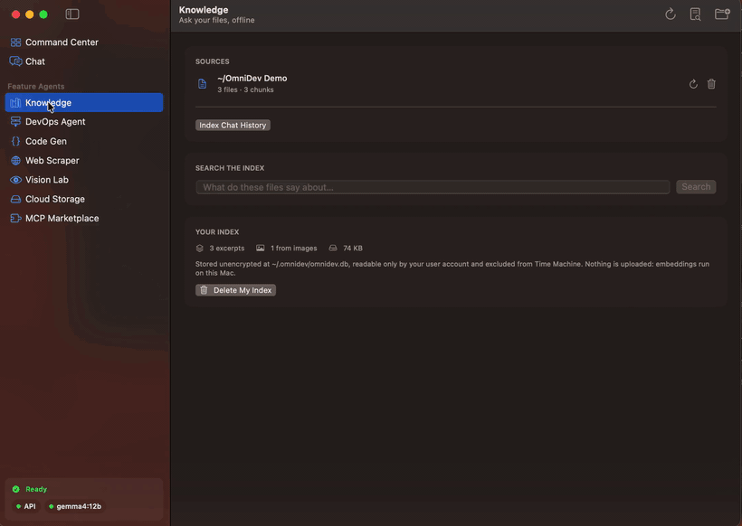
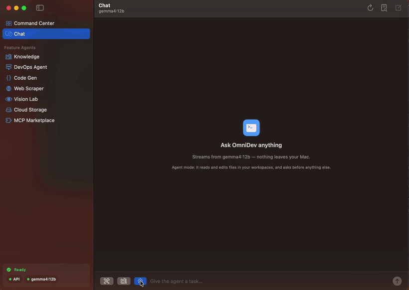

# OmniDev

**Ask your Mac anything, and let it do the work. Fully offline.**

Native macOS app. A local Gemma 4 model reads your files (including screenshots), answers with citations, and can edit code and run your tests, without a single byte leaving your machine.

[Download](https://github.com/himanshu748/omnidev/releases/latest) · [Landing page](https://omnidev-flame.vercel.app) · [Architecture](docs/ARCHITECTURE.md) · [API Reference](docs/API.md) · [Contributing](CONTRIBUTING.md)


-222222?logo=ollama&logoColor=white)
-4285F4?logo=google&logoColor=white)




*A real screen recording of the app. The payment reference existed only inside a PNG, read by on-device OCR and cited back. No wifi, no API key, no bill. The `.env` in the same folder was refused, not indexed. The wait for the local model is sped up; everything else is real time.*

## Agent mode

Give it a task instead of a question. It reads, edits, runs your tests and reports back, asking permission before anything outside the folders you trust.



*Also a real recording. The agent read the files, found the inverted operator, fixed it, then stopped and asked permission before running pytest. Verified afterwards: the file really is fixed and the test really passes. The thinking time is sped up.*

**It cannot delete your work.** There is no delete tool. Shell commands that remove files are refused by name, `git stash`, `clean`, `reset --hard`, `npm ci` and `make clean` are all blocked, and replacing an existing file's contents always asks first even inside a trusted folder. Every file it changes is snapshotted beforehand and restorable by id.

## How the index works

Point OmniDev at your Desktop, Documents and Downloads and ask questions about anything in them. Notes, PDFs, Office and iWork documents, code, and **screenshots**: images are read with on-device OCR (macOS Vision, ~42 ms each, no download), so text that only ever existed inside a picture is searchable like everything else. Flip the Knowledge toggle in Chat and answers are grounded in your own files, with citations. Or point at one specific file and ask about it directly, with no indexing at all.

Everything runs locally. Embeddings go to `localhost`, the index lives in `~/.omnidev`, and the same index is served to Claude Code through MCP (`search_knowledge`, `ask_file`).

### What is never indexed

The index stores plaintext excerpts, so some things are refused outright and cannot be enabled: `~/Library`, SSH and GPG and AWS credentials, keychains, browser profiles, password-manager vaults, and files matching `.env*`, `*.pem`, `*.key`, `id_rsa*`, `*.kdbx`, `.netrc`, `.npmrc` or shell histories. This holds even if you add a parent folder. You can exclude more in Settings, the index file is created `0600` and kept out of Time Machine, and **Delete My Index** erases everything in one click.

Files stored in iCloud with no local copy are skipped rather than downloaded, and OmniDev tells you how many, because reading them can hang indefinitely.

## What It Does

| Module | Purpose | Backend |
|--------|---------|---------|
| Agent | Give it a task: it reads, edits, runs tests and reports back, asking permission outside your workspaces. | Ollama or Gemini tool calling |
| Knowledge | Index notes, docs, code, screenshots and chat history locally, then ask grounded questions with citations. Works with wifi off. | Vision OCR + Ollama embeddings + SQLite |
| DevOps Agent | Parse natural-language AWS requests, inspect resources, and gate destructive actions behind confirmation. | Ollama or Gemini + boto3 |
| Code Gen | Generate project files for common web/backend frameworks with validation and browser-isolated preview/download flows. | Ollama or Gemini + optional Context7 |
| Web Scraper | Extract text, HTML, metadata, links, PDFs, or screenshots from authorized pages with Playwright-powered browser automation. | Playwright |
| Vision Lab | Analyze images, run OCR-style prompts, and ask custom visual questions. | Ollama vision or Gemini multimodal |
| Cloud Storage | Browse S3 buckets, list objects, upload files, delete objects, and generate presigned download URLs. | boto3 S3 |

## AI Providers: Offline by Default

OmniDev picks its AI provider through one setting, `AI_PROVIDER`:

| Mode | Behaviour |
|------|-----------|
| `auto` (default) | Uses Gemini when `GEMINI_API_KEY` is set; otherwise falls back to local Ollama. |
| `ollama` | Forces local Ollama, every AI service runs offline. |
| `gemini` | Forces Google Gemini (cloud). |

### Run fully offline with Ollama

```bash
# 1. Install Ollama (https://ollama.com), then:
ollama serve

# 2. Pull the default model: one model covers everything
ollama pull gemma4:12b        # text, structured intents, vision & OCR (~7.6GB, 256K context)
```

No API keys required. [Gemma 4 12B](https://ollama.com/library/gemma4:12b), the encoder-free unified multimodal model, handles DevOps intent parsing, code generation, and Vision Lab image analysis in a single download, with a 256K context window and the strongest coding of the laptop-class tiers (use Ollama ≥ 0.31 for the Apple Silicon multi-token-prediction speedup). On lower-memory machines, `ollama pull gemma4:e2b` and set both model vars to it. Override models and endpoint via `OLLAMA_MODEL`, `OLLAMA_VISION_MODEL`, and `OLLAMA_BASE_URL` in `backend/.env`; any Ollama model with structured-output support works.

The `/health` endpoint reports the active provider and model.

## Use OmniDev from Claude Code (MCP)

OmniDev ships an [MCP](https://modelcontextprotocol.io) server, so Claude Code, Claude Desktop, Cursor, any MCP client, can delegate work to your **free, private, on-device model** and the rest of the local engine.

```bash
# From the repo root, with the backend set up (make setup) and running (make backend):
claude mcp add omnidev -- "$PWD/backend/.venv/bin/python" "$PWD/backend/mcp_server.py"
```

Then, inside a Claude Code session:

> Use the omnidev local_llm tool to write a haiku about local models.

| Tool | What it does |
|------|--------------|
| `local_llm` | Text generation on the local Gemma 4 model, zero cloud calls, zero cost. |
| `local_vision` | Analyze or OCR a local image with the on-device vision model. |
| `scrape_url` / `crawl_site` | SSRF-guarded Playwright scraping and bounded same-domain crawling. |
| `generate_project` / `refine_project` | Validated multi-file codegen, files are returned as data, never written or executed. |
| `aws_plan` | Preview the boto3 plan for a natural-language AWS command. **Never executes**, approval stays in the OmniDev UI. |
| `search_knowledge` / `index_folder` / `list_knowledge_sources` | Query and manage the local knowledge index. Claude Code inherits everything you indexed, fully offline. |
| `list_models` / `pull_model` | Inspect provider status and pull local models. |

The server is a thin stdio bridge to the running backend (set `OMNIDEV_BACKEND_URL` if yours isn't on `http://127.0.0.1:8000`). From `backend/` you can also run it directly with `python -m app.mcp` or `make mcp`.

MCP works in both directions: the app's **MCP Marketplace** installs curated servers (Filesystem, Fetch, Memory, Time, Git, Sequential Thinking) whose tools Gemma 4 calls from chat, flip the Tools toggle and watch every call land in the transcript. Only the curated catalog can be installed, folder access is scoped to directories you pick inside your home folder, and server processes never see backend credentials.

## The macOS App

OmniDev ships as a native macOS `.app` (`macos/`): pure SwiftUI, Command Center, streaming Chat, and all five modules are native views over the local engine (port 8010). The app supervises only the FastAPI sidecar; Node/Next.js is not needed to run it. First launch opens a native onboarding window that checks Ollama and pulls `gemma4:12b` with live progress, a menu-bar extra tracks engine health, and Settings (⌘,) controls provider, read-only DevOps mode, and the engine port.

```bash
# Build and run the macOS app from source
./script/build_and_run.sh
```

Stop the engine sidecar any time with `scripts/macos/stop-omnidev.sh`. See [docs/MACOS_APP.md](docs/MACOS_APP.md) for packaging details. Windows and Linux packages are planned next.

## Claude Code on the Local Model

Ollama exposes an Anthropic-compatible API, so Claude Code can point at the same local Gemma model OmniDev manages, with no cloud and no API key:

```bash
make claude-local
# or directly:
ANTHROPIC_BASE_URL=http://localhost:11434 ANTHROPIC_AUTH_TOKEN=ollama claude --model gemma4:12b
```

**Use this for generation, not for agentic work.** That is a measured limit, not a hedge:

- Claude Code sends a **29,432 token** harness prompt (system prompt plus tool and skill definitions) before you type anything. Ollama serves most models with a 4,096 token context by default, so a small model fails immediately with `exceed_context_size_error`. `gemma4:12b` has a 256K context and fits it.
- Fitting it is not the same as following it. Given a one line bug fix with `--permission-mode acceptEdits`, gemma4:12b described which tools it would use and never called `Edit`. The file was unchanged.

So the honest scope is single shot generation: drafting a function, explaining a file, writing a commit message. For work that requires reading, editing and verifying, use Claude's own models, or use **OmniDev's own agent** (the Agent toggle in Chat), which is built around this exact limitation: narrow tools, forgiving errors and a plan/act loop, rather than a 29k token harness the model has to interpret.

For delegating generation to the local model from a cloud Claude session, use the MCP `local_llm` tool instead. Cloud model for the reasoning, free local Gemma for the tokens.

## Product Surface

- The native macOS app is the product: Command Center, streaming Chat, and all module pages are SwiftUI views over the local FastAPI engine.
- The backend also serves interactive API docs at `/docs` and an MCP server for external agents.

## Architecture

```text
omnidev/
├── macos/                       # fully native SwiftUI app
│   └── Sources/OmniDevMac/
│       ├── App/                 # app entry, menu-bar extra, Settings
│       ├── Services/            # sidecar lifecycle + URLSession API bridge
│       └── Views/               # cockpit, chat, and all module views
├── backend/
│   ├── app/
│   │   ├── main.py              # FastAPI app and Playwright lifespan
│   │   ├── config.py            # env/.env-backed settings (AI provider, models)
│   │   ├── routers/             # HTTP endpoints
│   │   ├── services/
│   │   │   ├── ai_service.py    # provider layer: Ollama (local) / Gemini (cloud)
│   │   │   └── ...              # boto3, Playwright, codegen, vision logic
│   │   └── schemas/             # Pydantic request/response models
│   ├── requirements.txt         # direct dependency constraints (lock input)
│   ├── requirements.lock        # hashed, reproducible install set
│   └── .env.example
├── scripts/macos/               # launch/stop/package sidecar scripts
├── docs/
└── README.md
```

## Quick Start

### Prerequisites

- macOS with Xcode command-line tools (for the native app), or any OS for the backend alone.
- Python 3.11+; Python 3.13 is used for local verification.
- [Ollama](https://ollama.com) for offline AI (or a `GEMINI_API_KEY` for cloud AI).

### Option A: Download the app (recommended)

Grab `OmniDev-vX.Y.Z.dmg` and `SHA256SUMS.txt` from [GitHub Releases](https://github.com/himanshu748/omnidev/releases), verify the download, then drag `OmniDev.app` to Applications (a zip of the same app is also attached). The checksum detects a corrupted download but does not authenticate this unsigned build. On first launch, use Finder's right-click → Open flow and review the warning carefully. For a fully inspectable path, build from source instead.

The engine self-installs into `~/Library/Application Support/OmniDev` on first run (needs Python 3.11+ on the machine) and starts automatically every time the app opens. In-app **Check for Updates…** points at new releases.

### Option B: Build from source

```bash
./script/build_and_run.sh
```

This builds the SwiftUI app, starts the FastAPI engine sidecar from the checkout, and opens the native window.

### Option C: Backend only (any OS)

```bash
cd backend
python3.13 -m venv .venv
source .venv/bin/activate
pip install --require-hashes -r requirements.lock
playwright install chromium
cp .env.example .env
uvicorn app.main:app --reload
```

API docs are at `http://localhost:8000/docs`.

## Configuration

Create `backend/.env` from `backend/.env.example`.

```bash
# AI provider: auto | gemini | ollama  (auto = Gemini if key set, else local Ollama)
AI_PROVIDER=auto

# Ollama (local, offline): gemma4:12b covers text + vision in one model
OLLAMA_BASE_URL=http://localhost:11434
OLLAMA_MODEL=gemma4:12b
OLLAMA_VISION_MODEL=gemma4:12b

# Gemini (cloud, optional, free key at https://aistudio.google.com/apikey)
GEMINI_API_KEY=
GEMINI_MODEL=gemini-2.0-flash

# Optional docs grounding for Code Gen
CONTEXT7_API_KEY=

# Optional explicit AWS credentials.
# If omitted, boto3 uses the standard AWS credential chain:
# ~/.aws/credentials, AWS SSO/session env, instance role, etc.
AWS_ACCESS_KEY_ID=
AWS_SECRET_ACCESS_KEY=
AWS_DEFAULT_REGION=us-east-1

```

Credential needs by module:

| Module | AI (Ollama or Gemini) | AWS | Context7 |
|--------|----------------------|-----|----------|
| DevOps Agent | Required (offline OK with Ollama) | Required through boto3 chain | No |
| Code Gen | Required (offline OK with Ollama) | No | Optional |
| Web Scraper | No | No | No |
| Vision Lab | Required (offline OK with Ollama) | No | No |
| Cloud Storage | No | Required through boto3 chain | No |

## API Snapshot

All backend routes are served from `http://localhost:8000` by default (`8010` under the macOS app).

| Method | Endpoint | Notes |
|--------|----------|-------|
| `GET` | `/health` | Service health check; reports active AI provider and model. |
| `POST` | `/api/devops/command` | Natural-language AWS command; destructive operations require `confirm_destructive: true`. |
| `POST` | `/api/devops/plan` | Plan preview for a natural-language AWS command, never executes (used by the MCP `aws_plan` tool). |
| `POST` | `/api/chat/stream` | Streaming chat with SQLite session memory (`session_id`), optional MCP tool calling (`use_tools`) and knowledge grounding (`use_knowledge`). |
| `POST` | `/api/knowledge/sources` | Register a folder (or chat history) in the local knowledge index; `/api/knowledge/search` retrieves grounded excerpts. |
| `GET` | `/api/mcp/catalog` | Curated MCP server catalog; `/api/mcp/servers` CRUD + per-server tool listing. |
| `POST` | `/api/git/land` | Commit a validated generated project under `~/OmniDev/projects/<slug>`, no shell, no hooks, no remotes. |
| `POST` | `/api/codegen/generate` | Returns validated generated files and instructions. Backend does not execute generated code. |
| `POST` | `/api/scraper/scrape` | Browser-based extraction for text, HTML, screenshots, links, metadata, and PDFs. |
| `POST` | `/api/vision/analyze` | Multipart image analysis. |
| `GET` | `/api/storage/buckets` | Lists S3 buckets as `{ name, creation_date }` objects. |
| `GET` | `/api/storage/files` | Lists S3 objects for a bucket and optional prefix. |
| `POST` | `/api/storage/upload` | Uploads a file to S3. |
| `GET` | `/api/storage/download` | Returns a presigned download URL. |
| `DELETE` | `/api/storage/files` | Deletes an S3 object. |

See [docs/API.md](docs/API.md) for request and response examples.

## Agent Safety

**The agent never deletes anything.** This is enforced in four places, each with a test:

- There is no delete tool. `rm`, `rmdir`, `unlink`, `shred`, `trash`, `truncate` and `dd` are refused by name with an explanation, not a generic allowlist error.
- Commands that remove work are blocked even though the base command is allowed: `git stash`, `git clean`, `git reset --hard`, `npm ci`, `make clean`, and any argument containing `--delete`, `--force`, `-rf` or `--prune`.
- Replacing an existing file's contents is treated as destruction, so it asks for approval **even inside a trusted workspace**. Creating a new file does not.
- Every file the agent changes is copied aside first, into `~/.omnidev/agent-backups`, and restorable by id through `POST /api/agent/backups/{id}/restore`.

The agent also records your git HEAD before its first change and never commits on your behalf. Shell access is an argv allowlist, never a shell string, so there is no quoting or chaining to reason about, and it can never reach a remote or rewrite history.

Approvals are per action, with allow once, always (for that run only) and deny. An unanswered prompt is a denial, never an approval, so a closed window cannot authorise anything.

- Generated code is returned as files for review, download, or isolated browser preview; OmniDev does not run generated projects on the backend.
- Code Gen blocks unsafe paths, duplicate case-insensitive paths, secret-like outputs, risky npm lifecycle hooks, and suspicious script bodies.
- DevOps operations are mapped to explicit boto3 actions before execution.
- Destructive DevOps actions require a confirmation flag.
- AWS credentials stay local and are resolved by boto3; no credential values should be committed to the repo.
- In Ollama mode, prompts and images never leave your machine.

## Verification

Common checks:

```bash
cd backend && pytest
cd macos && swift build
```

## Documentation

| Document | Description |
|----------|-------------|
| [Architecture](docs/ARCHITECTURE.md) | System design and project structure. |
| [API Reference](docs/API.md) | REST endpoints and examples. |
| [macOS App](docs/MACOS_APP.md) | Native shell build and packaging. |
| [Deployment](docs/DEPLOYMENT.md) | Local-first policy; marketing-site and app releases. |
| [Design System](docs/DESIGN.md) | Visual system and UI references. |
| [Contributing](CONTRIBUTING.md) | Contribution guide. |
| [Changelog](CHANGELOG.md) | Release notes. |
| [Code of Conduct](CODE_OF_CONDUCT.md) | Community standards. |

## License

MIT. See [LICENSE](LICENSE).
